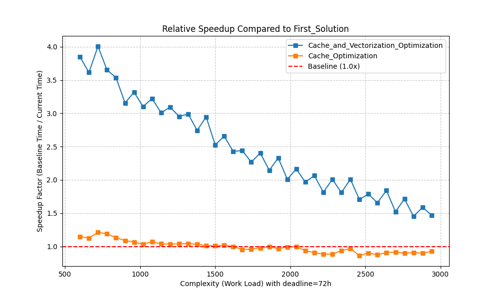

## Scheduling Algorithm Hardware Specific Optimizations

This evaluation focuses strictly on the computational throughput and execution latency of the scheduling engine. The following analysis compares the performance of three iterative versions of the algorithm: the initial scalar implementation (**First_Solution**), the cache-localized version (**Cache_Optimization**), and the final vectorized engine (**Cache_and_Vectorization_Optimization**).

### Benchmark Methodology

To ensure a fair comparison, all tests were conducted under controlled conditions:

* **Fixed Resolution:** The discretization resolution was locked at **10,000** units. This ensures that the state-space size remains consistent across different workload volumes.
* **Statistical Stability:** Each data point represents the **average of 5 consecutive runs** to eliminate noise from OS context switching and background tasks.
* **Complexity Scaling:** We tested 40 distinct job requests, scaling the workload "length" to observe how the algorithm handles increasing computational pressure.
* **Profiler Validation:** The benchmark metrics were explicitly designed to verify the resolution of hardware-level bottlenecks identified during initial `perf` profiling—specifically targeting L1 cache miss reductions and instructions-per-cycle (IPC) improvements in the DP hot-path.

### Comparative Performance Analysis

The primary metric for this evaluation is **Execution Time (seconds)**. As the scheduling engine must support real-time UI interactions, reducing the time-to-solution is critical.

#### 1. Baseline vs. Cache Optimization

The **First_Solution** (represented by the blue line in Figure 1) exhibited both high latency and significant variance, especially at lower complexity levels where execution times peaked near 16 seconds.

By refactoring the data structures from an **Array of Structs (AoS)** to a **Struct of Arrays (SoA)**, the **Cache_Optimization** version (green line) achieved a more stable performance profile. While the raw speedup was modest (up to 33%), the primary benefit was the reduction in "jitter" or performance spikes, providing a more predictable latency for the scheduler.

#### 2. The Impact of SIMD Vectorization

The most significant performance leap was achieved through manual **AVX-512 vectorization**. By processing 8 double-precision states simultaneously within the DP hot-path, the **Cache_and_Vectorization_Optimization** (orange line) drastically reduced execution time across the entire spectrum.

*Figure 1: Execution Time (s) vs. Workload Complexity.*

As shown in Figure 1, the vectorized implementation brought the execution time down from ~15 seconds to **under 4 seconds** for the most complex tasks, with typical tasks completing in approximately **1 second**.

### Relative Speedup and Scaling

To understand the efficiency gains, we analyzed the **Speedup Factor** (Baseline Time / Optimized Time). This metric highlights how the optimizations behave as the problem size scales.

*Figure 2: Speedup Factor compared to First_Solution.*

#### 3. Peak Gains and Asymptotic Convergence

* **Peak Performance:** At lower complexity levels, the vectorized engine achieved a **4.0x speedup** over the baseline. This is where the overhead of the original scalar loops was most punitive.
* **Asymptotic Behavior:** As complexity increases, the speedup factor tends to converge toward a lower stable ratio (approx. 1.5x). This is an expected result of our **fixed resolution** methodology. Because the resolution is constant (10,000 units), as the total workload increases, the relative density of the DP transitions per unit of work changes. The algorithmic complexity is inversely proportional to the total workload; essentially, as the "workload" grows toward infinity, the fixed-size discretization grid becomes the dominant factor, causing the performance curves of different implementations to meet asymptotically.

### Profiling the Optimized Engine

To validate that the optimizations eliminated the overhead identified during [profiling of the baseline](flamegraph_before_opt.svg), we re-profiled the final `Cache_and_Vectorization` build under the same conditions. The resulting flame graph confirms a fundamentally different execution profile:

[**Open Interactive Flame Graph — After Optimization (Cache + AVX-512 SIMD)**](flamegraph_after_opt.svg){ target="_blank" }
*Hover over frames for sample counts and self-percentages; click to zoom into a subtree; Ctrl+F to search.*

The contrast with the baseline flame graph is striking. Where the scalar baseline spent only **~42% of `calc_single` time on actual DP computation**, the optimized engine achieves **85.1% self-time** in `calc_single` — nearly all CPU cycles are now spent on useful SIMD-vectorized state transitions. The overhead categories that previously dominated the profile have been effectively eliminated:

| Overhead source | Before | After | Change |
|---|---|---|---|
| `operator new` / `operator delete` | ~22% | <0.1% | Removed from hot-path; single `posix_memalign` pre-allocation |
| `MemoEntry` struct copies | ~7% | 0% | Eliminated by SoA layout (contiguous scalar arrays) |
| Vector reallocation (`_M_realloc_insert`) | ~7% | 0% | Eliminated by pre-allocated buffers |
| Cost function hash lookups | ~6% | 0% | Replaced by precomputed lookup table |
| **`calc_single` self (useful computation)** | **~42%** | **~85%** | SIMD vectorization + branchless logic |

### Conclusion on Execution Latency

The transition from a naive scalar implementation to a cache-aware, SIMD-accelerated engine resulted in a **75% reduction in peak latency**. While all versions produced identical scheduling results (validating the mathematical integrity of the optimizations), the vectorized engine is the only version capable of maintaining the "sub-second" response time required for a fluid, interactive user experience during typical scheduling scenarios.