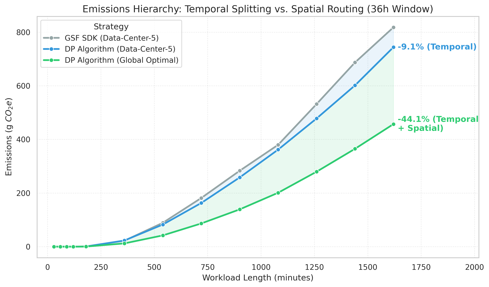
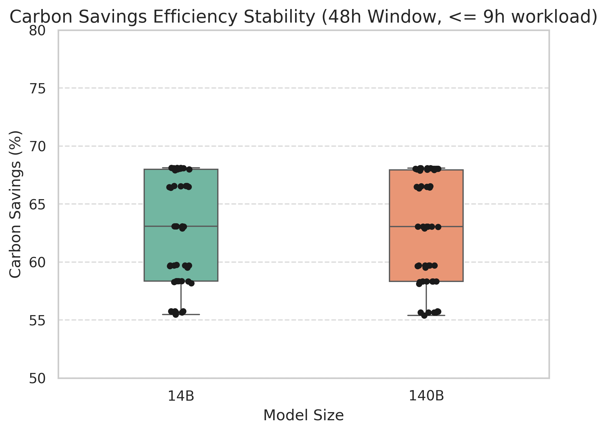
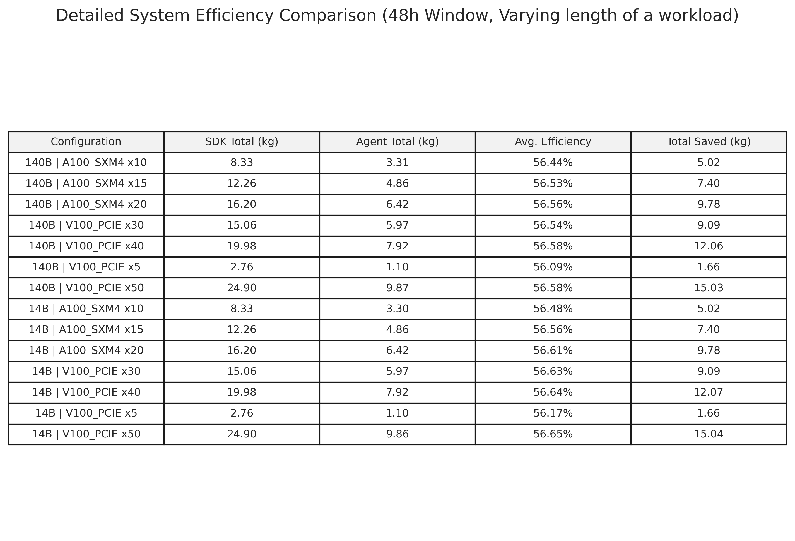
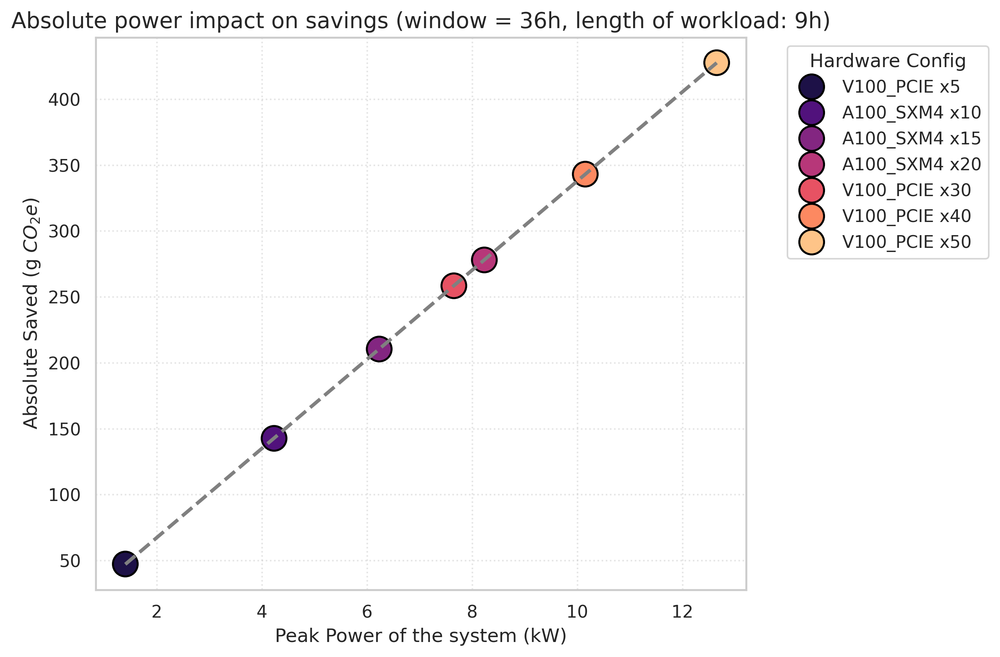
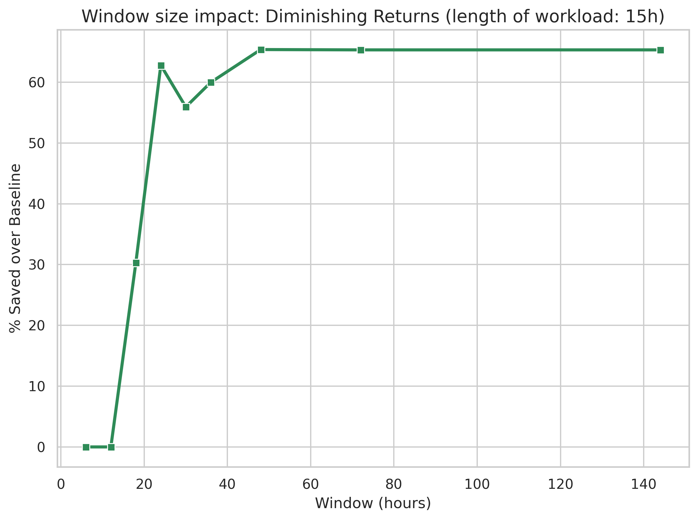
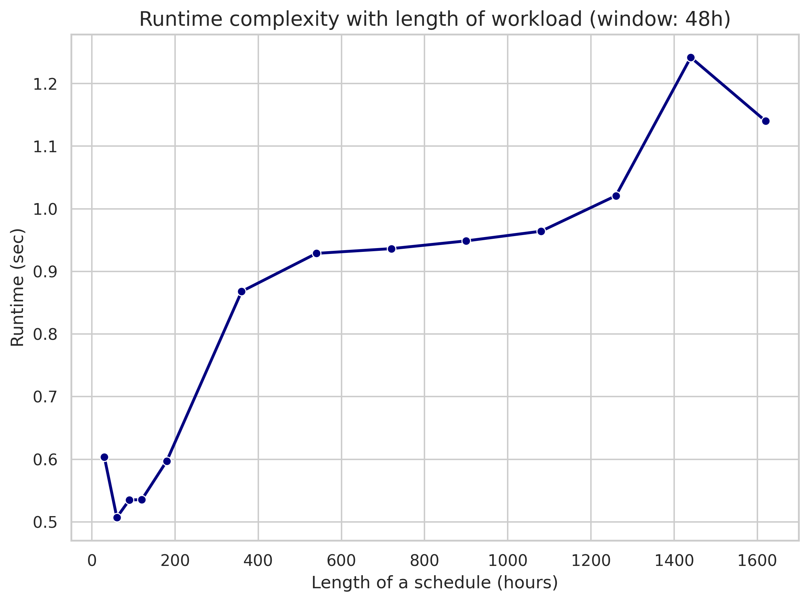

# Algorithmic Carbon Optimization: A Comparative Analysis of Deterministic DP Scheduling vs. GSF SDK

## 1. Executive Summary
This report evaluates the carbon-reduction efficacy of our proprietary scheduling algorithm against the Green Software Foundation (GSF) SDK baseline. Through rigorous simulation across varying compute scales, hardware profiles, and scheduling windows, we demonstrate that our algorithm consistently outperforms the baseline in the evaluated scenarios. Operating as a fully predictable, stable, and deterministic algorithm based on dynamic programming (DP), its action space is a superset of the SDK's (incorporating workload splitting and multi-node routing). 

While the algorithm mathematically guarantees emissions equal to or lower than the baseline via intelligent pausing and resuming, our extended analysis reveals a critical hierarchy in carbon optimization: while temporal splitting yields reliable baseline improvements, spatial routing acts as the primary multiplier, accounting for the largest share of the observed carbon reductions. Empirical results show significant efficiency gains, scaling linearly with system power while maintaining constant, sub-second algorithmic overhead.

## 2. Methodology

### 2.1 Technical Alignment and Baseline Fairness
To ensure a rigorous "apples-to-apples" comparison, the experimental framework was designed to isolate algorithmic efficiency from external data variables:

* **Standardized API Integration:** The baseline is derived from the official [Green Software Foundation (GSF) Carbon Aware SDK](https://github.com/Green-Software-Foundation/carbon-aware-sdk). To synchronize data inputs, a mock API layer was implemented to intercept SDK requests and relay them to our internal Carbon Intensity Prediction API. This guarantees that both the GSF SDK and our DP scheduler operate on identical forecast data, ensuring results are strictly comparable.
* **Hardware Parity:** We synchronized hardware constants across both testing suites. By using identical power profiles and computational throughput metrics, we ensure that the "Workload Amount" (the total energy required to complete the task) remains a constant baseline across all simulations.
* **Optimal Baseline Selection (The "Best-Site" Constraint):** By default, the GSF SDK identifies the optimal start time for a contiguous workload at a single location. To provide the most competitive baseline possible, we extended this logic: for every test case, we manually iterate the SDK across all available data centers to identify the single site with the lowest carbon footprint. 
* **Isolation of Variables:** This setup levels the playing field by granting the SDK "best-site" knowledge. Consequently, any observed delta in performance is strictly a result of algorithmic correctness and scheduling logic (temporal splitting and spatial routing), rather than differences in prediction accuracy or site selection.

#### Summary of Control Variables
| Variable | Control Method |
| :--- | :--- |
| **Data Source** | Unified Prediction API (Generic for both algorithms) |
| **Hardware** | Identical Power, Throughput, and Component Constants |
| **Site Selection** | SDK pre-optimized for the best available single Data Center |
| **Optimization Focus** | Contiguous execution (SDK) vs. Deterministic Splitting (DP) |

### 2.2 Dataset and Scenario Configuration

All experiments are conducted using a fixed set of five geographically distributed data centers within the United Kingdom. These locations are referenced throughout the report using abstract identifiers to simplify presentation: Data-Center-1 (UK London), Data-Center-2 (North West England), Data-Center-3 (South Wales), Data-Center-4 (South West England), and Data-Center-5 (North Scotland).  

Carbon intensity forecasts are evaluated over a 144-hour prediction horizon. This extended horizon allows the scheduling algorithms to explore long-term temporal flexibility when searching for optimal execution windows. However, the majority of comparative experiments and visualizations focus on scheduling windows up to 48 hours, which better reflects realistic operational deadlines for many compute workloads while still providing sufficient flexibility for meaningful carbon-aware optimization.

### 2.3 Baseline vs. DP Algorithm Paradigms
The core differentiator in this comparison is the constraints placed on the scheduling optimizer:
* **GSF SDK (Baseline):** Operates under a strict continuous execution constraint. Given a workload of length L and a deadline window W, it scans for a single, contiguous temporal block of length L that yields the lowest average carbon intensity. It assumes constant power draw for the duration of the workload and restricts execution to a single pre-selected location.
* **DP Algorithm (Proposed):** Operates under a relaxed constraint model using a fully deterministic dynamic programming approach. It retains the ability to execute contiguous blocks but introduces the optimal capacity for temporal splitting (pausing/resuming) and spatial routing (distributing across multiple locations or nodes). It systematically calculates exactly *when* and *where* slices of computation should occur within the window W to achieve the absolute global minimum carbon footprint.
* **The Cost of Splitting (Startup Overhead):** Crucially, the temporal splitting in the DP algorithm is not computationally free. Every pause and resume action incurs a Startup Energy Tax—a measurable energy spike caused by BIOS/POST surges, OS/container initialization, and massive VRAM weight transfers across PCIe/SXM bridges. The DP algorithm calculates this overhead dynamically based on the specific hardware profile. It will only execute a split if the carbon savings extracted from the greener grid periods strictly outweigh the emissions generated by the startup overhead.
* **Shared Physical Constraints (Max Power Limits):** Both algorithms strictly respect the hardware's peak power capacity (`max_power`). Neither algorithm can artificially compress a lengthy workload into a single, highly efficient 5-minute green window by drawing infinite power. Computation is strictly bottlenecked by the physical throughput limits of the specified GPU cluster.

### 2.4 Technical Setup & Hardware Profiles
The simulation environment relies on dual REST API endpoints orchestrating the GSF SDK logic and the proposed DP backend, fed by deterministic 5-minute resolution carbon intensity grids. To ensure relevance to modern datacenter topologies, tests were conducted across configurations representing industry-standard AI infrastructure (14B and 140B parameter models). 

Hardware constants, including peak power draw (kW) and the specific components of the Startup Energy Tax (idle GPU draw, system base watts, and bus transfer speeds in GB/s), were mapped directly from official Nvidia specifications for V100 (PCIe) and A100 (SXM4) architectures. This ensures the penalty for splitting a workload perfectly mirrors real-world physical infrastructure costs.

### 2.5 Metric Definitions
* **Workload Length (L):** Total required compute time.
* **Window Length (W):** The total allowable time (deadline) before which the workload must complete. 
* **Absolute Savings (gCO2):** EmissionsSDK - EmissionsAlgorithm
* **Relative Efficiency ((\%)):** 100 * (Absolute Savings)/EmissionsSDK

## 3. Comparative Performance Analysis

### 3.1 Baseline Validation and Divergence

  
   
  <b>Figure 1:</b> Baseline validation of GSF SDK against our solution.

Figure 1 illustrates the consistent performance advantage of the DP algorithm over the baseline. As Workload Length increases within a fixed window, the GSF SDK is forced into increasingly suboptimal, high-carbon intensity hours due to its contiguous execution constraint. The DP algorithm actively avoids these peaks through calculated workload splitting. Because the algorithm requires green savings to mathematically exceed the startup overhead, shorter workloads native to the DP engine often mimic the SDK (enforcing a "no splitting penalty"), but as workload sizes grow, the divergence between the two curves illustrates the significant carbon penalty of the SDK's rigid scheduling.

### 3.2 The Emissions Hierarchy: Temporal vs. Spatial Dominance

  
   
  <b>Figure 2:</b> Emissions Hierarchy showing the dominant impact of Spatial Routing.

When decomposing the algorithm's savings, a stark hierarchy emerges demonstrating that spatial flexibility is significantly more impactful than temporal flexibility. 
Looking at Figure 2:
1. **Temporal-Only Advantage:** Restricting the DP algorithm to a single location (Data-Center-5) allows it to only utilize temporal splitting. At maximum workload length, this strategy yields a solid, yet bounded, 9.1% reduction in carbon over the GSF SDK baseline. It successfully navigates local grid peaks but is ultimately trapped by the overall regional grid intensity.
2. **The Spatial Multiplier:** When the DP algorithm is allowed to seek the "Global Optimal" path by routing the workload across different geographic zones, savings increase to approximately 44.1%. 

This massive divergence proves that while temporal splitting provides a necessary foundational optimization (navigating local spikes), geographic arbitrage (escaping dirty regional grids entirely) is the definitive factor for achieving substantial carbon reductions.

### 3.3 Hardware and Scale Invariance

  
   
  <b>Figure 3:</b> Model Efficiency Table

* **Model Size Agnosticism:** Figure 3 shows comparative distributions for 14B and 140B models, demonstrating that the DP optimization logic shows minimal sensitivity to parameter count or computational density.

  
   
  <b>Figure 4:</b> Parameter Scale Invariance

* **Hardware Agnosticism:** Figure 4 shows efficiency yields (around 56%) remain stable across A100 and V100 nodes. The variance observed is strictly environmental (carbon intensity of the grid during the given window) rather than algorithmic.

### 3.4 System Leverage (Absolute vs. Relative)

  
  
   
  <b>Figure 5:</b> Absolute Carbon Leverage (Left) demonstrating linear scaling of emissions reduction with system power, and Relative Efficiency Stability (Right) proving consistent algorithmic performance across all hardware scales.

* **Relative Efficiency:** On Figure 5 the slope of the Relative Efficiency regression line approaches zero. This demonstrates that proportional carbon savings are an inherent property of the DP logic, remaining highly stable regardless of system power draw.
* **Absolute Leverage:** Figure 6 demonstrates that because relative efficiency is stable, Absolute Savings scale perfectly linearly with peak power. Larger computational clusters yield proportionally massive absolute carbon reductions without degrading the optimizer's effectiveness.

## 4. The Flexibility Frontier (ROI Analysis)

  
  
   
  <b>Figure 6:</b> The Flexibility Frontier (Left) illustrating the saturation point of carbon savings, and the ROI Heatmap (Right) identifying the optimal scheduling window for maximum intensity reduction.

The system's capacity to save carbon is fundamentally bounded by user flexibility—defined as the ratio of Window Length (W) to Workload Length (L). 
* **The Patience Payoff:** The Figure 6 demonstrates a non-linear relationship between deadline extension and carbon savings. There is a sharp inflection point where the algorithm gains enough temporal "runway" to largely avoid daily carbon peaks, after which savings plateau.
* **Configuration Independence:** Figure 6 also confirms that grid flexibility (Y-axis) entirely dictates the percentage of carbon saved, while raw power (X-axis) has negligible impact on the percentage.

## 5. System Complexity and Scalability

  
  
   
  <b>Figure 7:</b> Algorithmic Complexity and Runtime Stability: Sub-second execution scaling linearly with Workload Length (Left) and Scheduling Window (Right), ensuring real-time responsiveness for enterprise-scale deployments.

* **Temporal Scaling:** Based on Figure 7 we conclude that as the scheduling Window increases (up to 140+ hours), the DP runtime complexity scales linearly, but absolute computation time remains negligible (peaking at ~1.2 seconds). 
* **Schedule Length Scaling:** It also shows that complexity plateaus at sub-second levels regardless of how heavily fragmented the resulting schedule becomes. This guarantees real-time, deterministic orchestration capabilities with near-zero overhead.

## 6. Limitations and Assumptions

The results presented in this comparison rely on several simplifying assumptions. 
First, the carbon intensity forecasts are treated as deterministic and perfectly 
accurate within the evaluated scheduling window. In real-world deployments, 
forecast uncertainty may reduce the achievable optimization gains. 

Also, the baseline comparison reflects the current operational constraints 
of the Carbon Aware SDK, which optimizes contiguous workloads within a single 
location. Future versions of such systems may incorporate additional flexibility, 
which would narrow the performance gap observed in this evaluation.

Despite these limitations, the experiments provide strong evidence that 
spatio-temporal scheduling can substantially improve carbon efficiency when 
sufficient workload flexibility is available.

## 7. Conclusion
The GSF SDK currently represents the industry standard for carbon-aware computing. This comparative evaluation This comparative evaluation provides strong evidence that our deterministic, dynamic programming-based architecture consistently and significantly outperforms this standard. By removing the contiguity constraint and mathematically accounting for exact hardware splitting overheads, our software guarantees equal or superior carbon profiles across all scenarios. 

Most importantly, our analysis exposes the true hierarchy of algorithmic decarbonization. While temporal optimization (pausing/resuming within a single region) provides a reliable ~9% improvement by dodging local spikes, spatial routing is the ultimate catalyst, capable of multiplying baseline savings nearly fivefold (up to ~44%) by migrating workloads across global energy borders. Because both architectures respect physical maximum power bottlenecks, the DP engine's dominance relies purely on strategic spatio-temporal placement rather than brute-force parallelization. The performance is scale-invariant, hardware-agnostic, and executes with sub-second overhead, demonstrating a substantial improvement over the evaluated baseline.