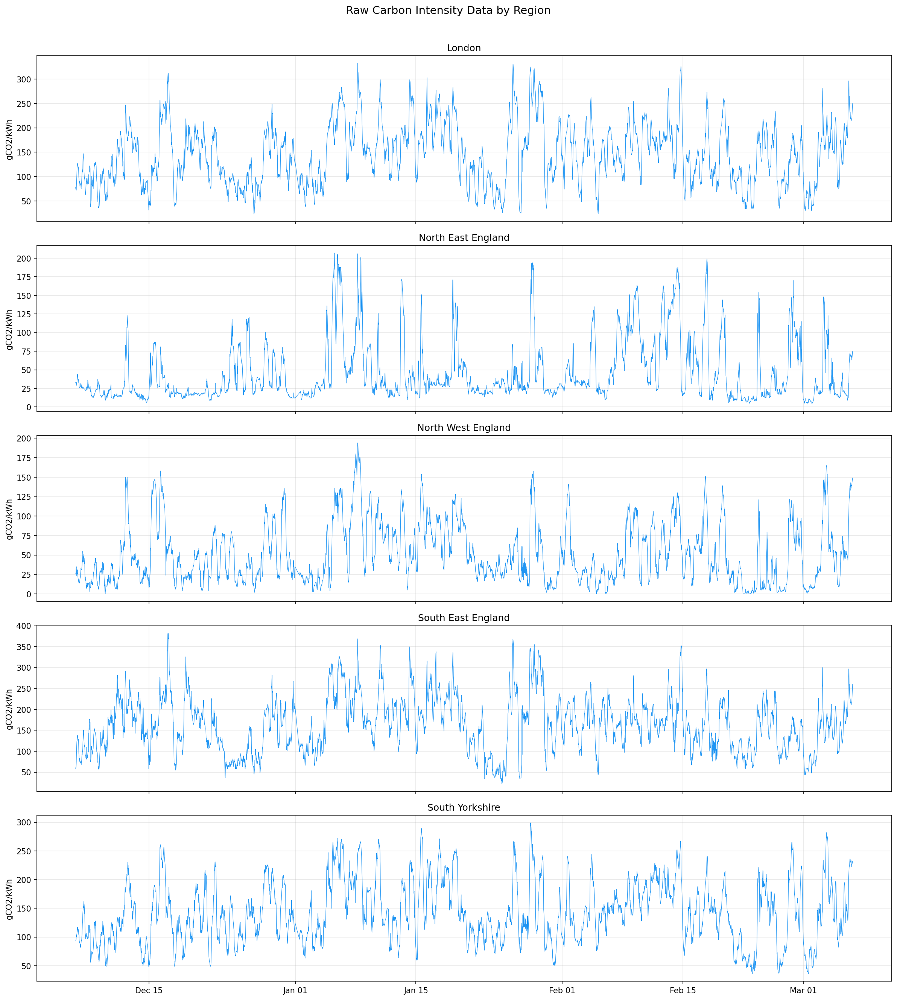
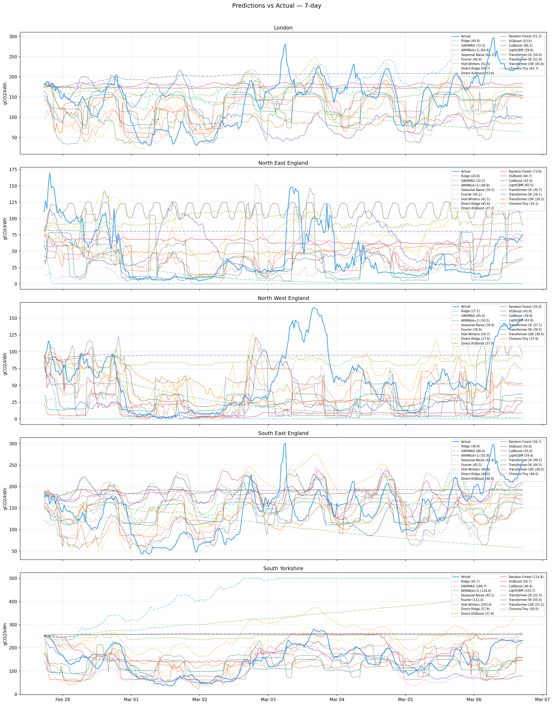
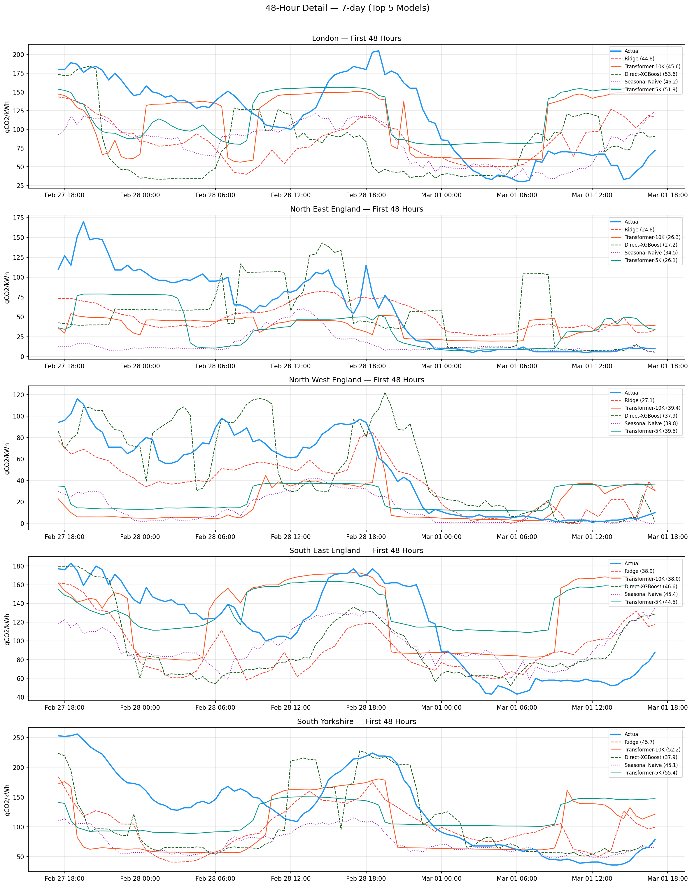
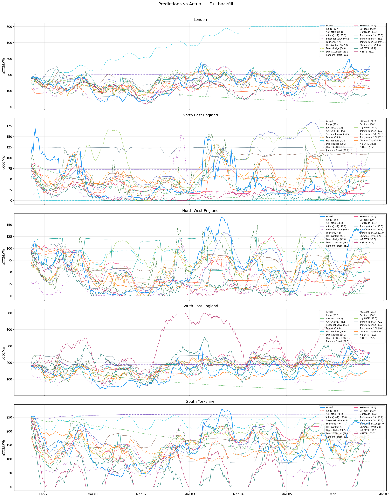
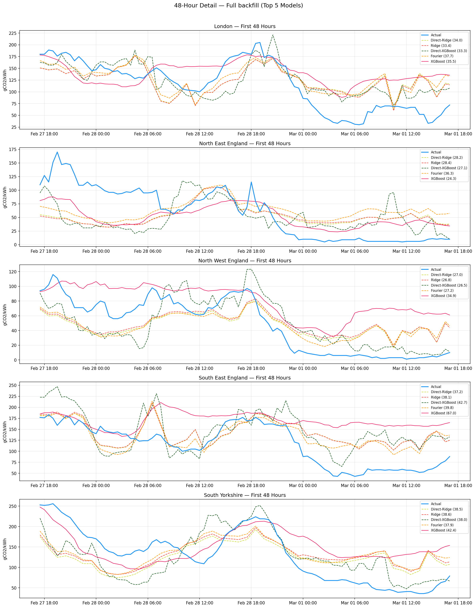
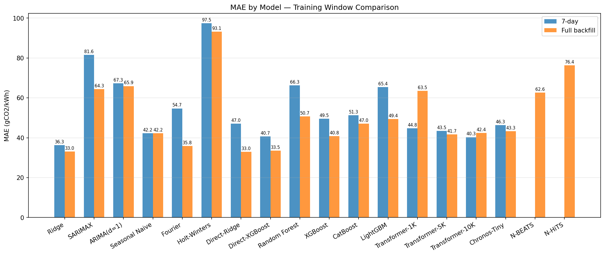
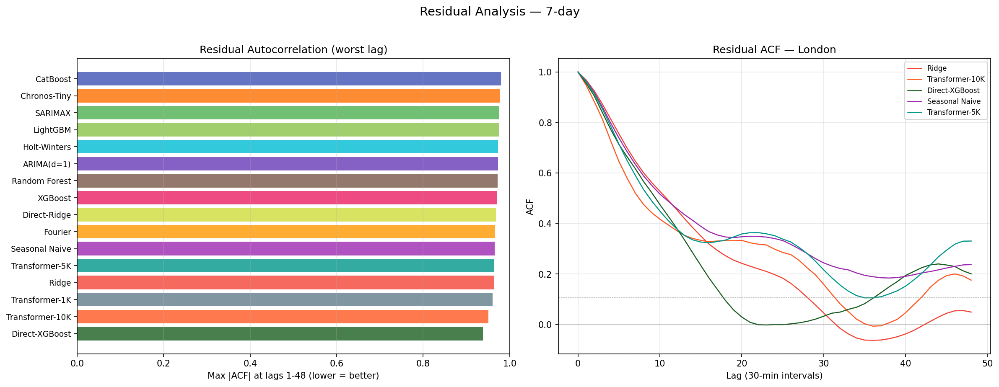
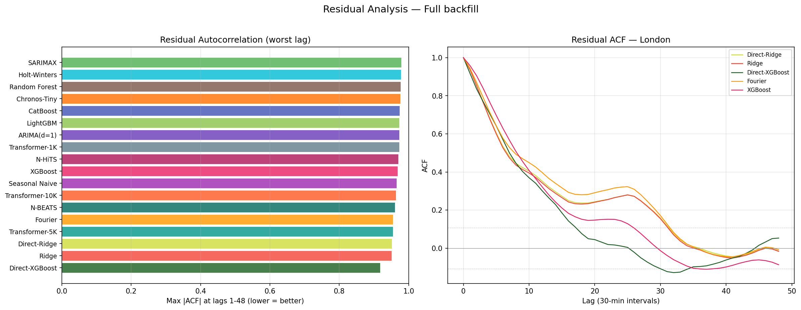
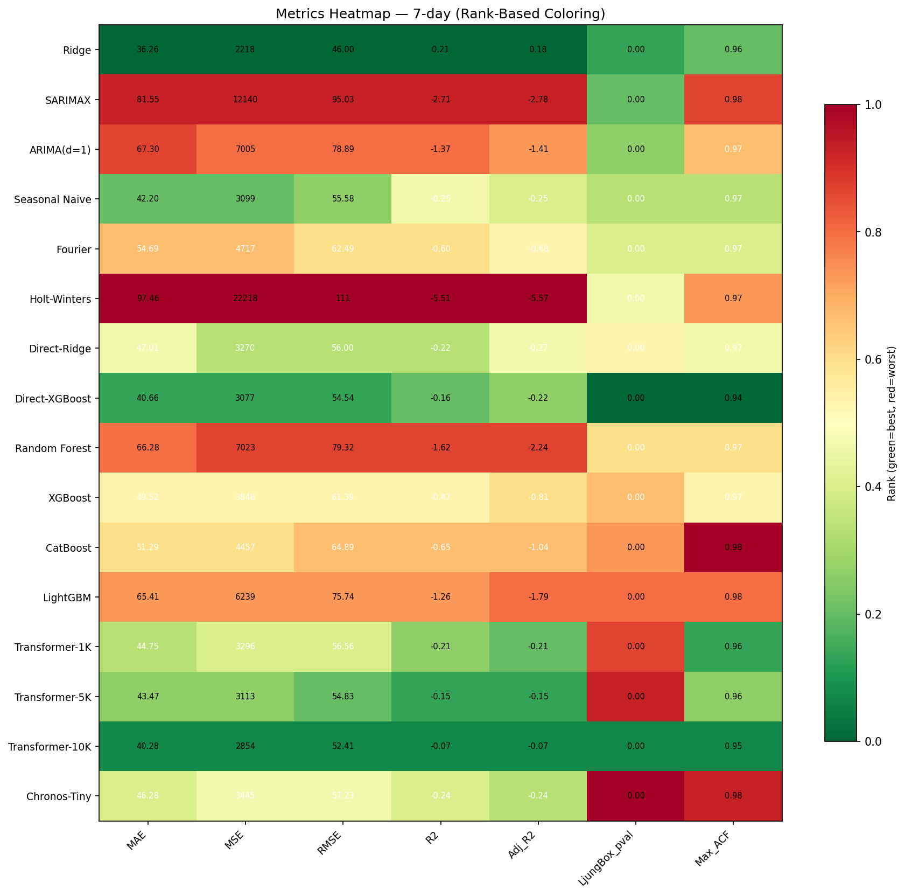
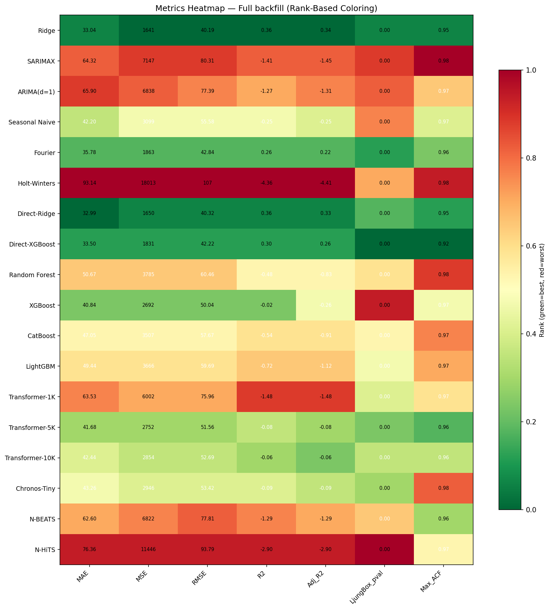

# Carbon Intensity Prediction Benchmark

## Overview

This report compares 18 forecasting models (7 statistical + 1 direct ML + 4 tree-based + 3 transformer + 1 foundation + 2 deep forecasting) on real UK carbon intensity data (gCO2/kWh). Models are evaluated on 7 metrics that measure both point accuracy and residual structure. Where applicable, models use lag-1 weather data (wind speed, temperature, solar radiation) from Open-Meteo as exogenous features. The benchmark tests different training window sizes to assess the effect of data volume on prediction quality.

## Test Setup

| Parameter | Value |
|-----------|-------|
| **Data source** | `carbon_intensity.db` (UK Carbon Intensity API) |
| **Regions** | London, North East England, North West England, South East England, South Yorkshire |
| **Date range** | 2025-12-06 11:30:00+00:00 to 2026-03-06 17:00:00+00:00 |
| **Total readings** | 21525 |
| **Frequency** | 30-minute intervals |
| **Test set** | Last 7 days |
| **Training (7-day)** | 336 points (6 days) |
| **Training (Full backfill)** | 3972 points (83 days) |

## Raw Data

## Metrics Explained

| Metric | Purpose |
|--------|---------|
| **MAE** | Mean Absolute Error — primary accuracy in gCO2/kWh |
| **MSE** | Mean Squared Error — penalizes large errors quadratically |
| **RMSE** | Root MSE — same scale as MAE, sensitive to outliers |
| **R-squared** | Fraction of variance explained; negative = worse than predicting the mean |
| **Adjusted R-squared** | R-squared penalized by number of model features |
| **Ljung-Box p-value** | Ljung-Box test at lag 48 (24h). High p-value (> 0.05) = residuals consistent with white noise (good). Low = significant autocorrelation remains (model missed structure) |
| **Max \|ACF\|** | Maximum absolute autocorrelation at lags 1-48. Lower is better — near 0 means no predictable structure left in residuals |

## Results: 7-day

### Accuracy Table

| Model | MAE | RMSE | R2 | LjungBox_pval | Max_ACF | Time (s) |
|-------|-------|-------|-------|-------|-------|----------|
| Ridge | 36.26 | 46.00 | 0.211 | 0.000 | 0.964 | 0.00 |
| SARIMAX | 81.55 | 95.03 | -2.710 | 0.000 | 0.976 | 1.06 |
| ARIMA(d=1) | 67.30 | 78.89 | -1.371 | 0.000 | 0.973 | 0.69 |
| Seasonal Naive | 42.20 | 55.58 | -0.246 | 0.000 | 0.966 | 0.00 |
| Fourier | 54.69 | 62.49 | -0.596 | 0.000 | 0.966 | 0.00 |
| Holt-Winters | 97.46 | 110.98 | -5.506 | 0.000 | 0.973 | 0.13 |
| Direct-Ridge | 47.01 | 56.00 | -0.218 | 0.000 | 0.968 | 0.01 |
| Direct-XGBoost | 40.66 | 54.54 | -0.165 | 0.000 | 0.938 | 0.33 |
| Random Forest | 66.28 | 79.32 | -1.623 | 0.000 | 0.972 | 4.91 |
| XGBoost | 49.52 | 61.39 | -0.466 | 0.000 | 0.970 | 0.66 |
| CatBoost | 51.29 | 64.89 | -0.651 | 0.000 | 0.980 | 0.49 |
| LightGBM | 65.41 | 75.74 | -1.261 | 0.000 | 0.976 | 0.56 |
| Transformer-1K | 44.75 | 56.56 | -0.214 | 0.000 | 0.961 | 0.45 |
| Transformer-5K | 43.47 | 54.83 | -0.146 | 0.000 | 0.964 | 0.28 |
| Transformer-10K | 40.28 | 52.41 | -0.066 | 0.000 | 0.950 | 0.39 |
| Chronos-Tiny | 46.28 | 57.23 | -0.238 | 0.000 | 0.977 | 3.83 |
| N-BEATS | N/A | N/A | N/A | N/A | N/A | N/A |
| N-HiTS | N/A | N/A | N/A | N/A | N/A | N/A |

*Averaged across 5 regions. Lower MAE/RMSE/Max_ACF is better. Higher R2/LjungBox_pval is better.*

### Predictions vs Actual

### Zoomed 48-Hour Detail

## Results: Full backfill

### Accuracy Table

| Model | MAE | RMSE | R2 | LjungBox_pval | Max_ACF | Time (s) |
|-------|-------|-------|-------|-------|-------|----------|
| Ridge | 33.04 | 40.19 | 0.360 | 0.000 | 0.951 | 0.00 |
| SARIMAX | 64.32 | 80.31 | -1.410 | 0.000 | 0.979 | 1.97 |
| ARIMA(d=1) | 65.90 | 77.39 | -1.267 | 0.000 | 0.973 | 1.15 |
| Seasonal Naive | 42.20 | 55.58 | -0.246 | 0.000 | 0.966 | 0.00 |
| Fourier | 35.78 | 42.84 | 0.259 | 0.000 | 0.955 | 0.00 |
| Holt-Winters | 93.14 | 107.21 | -4.361 | 0.000 | 0.978 | 0.91 |
| Direct-Ridge | 32.99 | 40.32 | 0.358 | 0.000 | 0.951 | 0.20 |
| Direct-XGBoost | 33.50 | 42.22 | 0.296 | 0.000 | 0.918 | 1.15 |
| Random Forest | 50.67 | 60.46 | -0.481 | 0.000 | 0.977 | 6.50 |
| XGBoost | 40.84 | 50.04 | -0.020 | 0.000 | 0.968 | 0.79 |
| CatBoost | 47.05 | 57.67 | -0.545 | 0.000 | 0.974 | 0.62 |
| LightGBM | 49.44 | 59.69 | -0.716 | 0.000 | 0.973 | 0.88 |
| Transformer-1K | 63.53 | 75.96 | -1.482 | 0.000 | 0.973 | 1.98 |
| Transformer-5K | 41.68 | 51.56 | -0.083 | 0.000 | 0.955 | 3.22 |
| Transformer-10K | 42.44 | 52.69 | -0.059 | 0.000 | 0.963 | 4.37 |
| Chronos-Tiny | 43.26 | 53.42 | -0.086 | 0.000 | 0.976 | 3.53 |
| N-BEATS | 62.60 | 77.81 | -1.287 | 0.000 | 0.960 | 6.96 |
| N-HiTS | 76.36 | 93.79 | -2.899 | 0.000 | 0.970 | 6.16 |

*Averaged across 5 regions. Lower MAE/RMSE/Max_ACF is better. Higher R2/LjungBox_pval is better.*

### Predictions vs Actual

### Zoomed 48-Hour Detail

## Training Data Volume Comparison

This chart compares MAE across training windows. Models that improve significantly with more data have learned meaningful temporal patterns. Models that stay flat or get worse may be overfitting or are insensitive to training volume.

## Residual Analysis — 7-day

**Max |ACF|** near 0 means the model's residuals look like white noise —it captured all the periodic structure in the data. Higher values suggest the modelmissed recurring patterns. The **ACF plot** shows autocorrelation in residuals; significant spikes at lag 48 (1 day) or lag 336 (1 week) indicate unmodelled seasonality.

## Residual Analysis — Full backfill

**Max |ACF|** near 0 means the model's residuals look like white noise —it captured all the periodic structure in the data. Higher values suggest the modelmissed recurring patterns. The **ACF plot** shows autocorrelation in residuals; significant spikes at lag 48 (1 day) or lag 336 (1 week) indicate unmodelled seasonality.

## Metrics Heatmap — 7-day

## Metrics Heatmap — Full backfill

## Model Details

### Statistical Models

- **Ridge Regression**: Ridge(alpha=1.0) with cyclical sin/cos features for hour, day-of-week, minute-of-day. Fast, interpretable, but limited to capturing smooth seasonality.
- **SARIMAX**: SARIMAX(1,0,1)(1,0,1,48) with training capped at 14 days. Captures autoregressive momentum and seasonal patterns. Uses d=0 (no differencing). Slower to fit.
- **ARIMA(d=1)**: SARIMAX(1,1,1)(1,0,1,48) — same as SARIMAX but with first differencing (d=1). Models changes rather than levels, making the series stationary. Addresses the persistence structure that d=0 misses.
- **Seasonal Naive**: Repeats the last 7 days of training data. Zero parameters, instant. Strong baseline when weekly patterns dominate.
- **Fourier Regression**: 3 daily + 2 weekly harmonics solved via OLS (numpy.linalg.lstsq). Prophet's core math without the overhead.
- **Holt-Winters**: Triple exponential smoothing with additive trend and seasonality (seasonal_periods=48). Struggles with noisy, multi-seasonal data.
- **Direct-Ridge**: Direct multi-step Ridge regression. Instead of recursive forecasting (predict t+1, feed back, repeat), trains a single Ridge model with the forecast horizon h as a feature. Each test point is predicted independently from real historical data — no error compounding. Features: cyclical time features, h/h-squared, recent history summary.
- **Direct-XGBoost**: Same direct multi-step approach as Direct-Ridge but using XGBRegressor(n_estimators=200, max_depth=6, lr=0.1). Gradient-boosted trees can capture nonlinear horizon-dependent patterns that Ridge cannot. Subsampled to 500K training pairs for efficiency.

### ML Tree-Based Models

- **Random Forest**: RF(n_estimators=200, max_depth=15) with lag + cyclical features. Walk-forward evaluation using actual history for lag computation.
- **XGBoost**: XGB(n_estimators=200, max_depth=6, lr=0.1). Gradient-boosted trees with the same feature set and walk-forward evaluation.
- **CatBoost**: CB(iterations=200, depth=6, lr=0.1). Ordered boosting with symmetric trees. Walk-forward evaluation.
- **LightGBM**: LGBM(n_estimators=200, max_depth=6, lr=0.1). Histogram-based gradient boosting. Walk-forward evaluation.

### Transformer Models

- **Transformer-1K**: Small transformer encoder (~1K parameters). Input projection + sinusoidal positional encoding + 1-layer TransformerEncoder (dim_feedforward=4*d_model, no dropout) + linear head on last position. Trained on sliding windows (seq_len=48, 50 epochs, Adam lr=0.001, grad clip=1.0). Recursive multi-step forecasting with Z-score normalization.
- **Transformer-5K**: Same architecture (~5K parameters), larger d_model.
- **Transformer-10K**: Same architecture (~10K parameters), largest d_model.

### Foundation Models

- **Chronos-Tiny**: Amazon's pre-trained time series foundation model (Chronos-T5-Tiny, ~8M parameters). Zero-shot forecasting — no training on local data. Tokenizes the historical series and generates predictions autoregressively using a T5 language model backbone trained on millions of diverse time series. Median of 20 sample trajectories.

### Deep Forecasting Models

- **N-BEATS**: Neural Basis Expansion Analysis for Time Series (Oreshkin et al., 2019). Direct multi-horizon forecasting — predicts all h steps at once, avoiding recursive error compounding. Decomposes forecast into interpretable trend and seasonality basis functions. Trained from scratch on local data (300 steps, input_size=96).
- **N-HiTS**: Neural Hierarchical Interpolation for Time Series (Challu et al., 2022). Improved N-BEATS with multi-rate signal sampling — uses hierarchical interpolation at different temporal scales. Direct multi-horizon output, no recursive forecasting. Trained from scratch (300 steps, input_size=96).

## Key Findings

**7-day** — Top 3 by MAE:
1. Ridge: MAE = 36.26 gCO2/kWh
2. Transformer-10K: MAE = 40.28 gCO2/kWh
3. Direct-XGBoost: MAE = 40.66 gCO2/kWh

**Full backfill** — Top 3 by MAE:
1. Direct-Ridge: MAE = 32.99 gCO2/kWh
2. Ridge: MAE = 33.04 gCO2/kWh
3. Direct-XGBoost: MAE = 33.50 gCO2/kWh

**Residual structure**: Models with high Ljung-Box p-values and low Max |ACF| leave no predictable structure in their residuals — they've captured the signal fully. Tree-based models with lag features tend to score well here because they can replicate recent patterns.

**Training volume effect**: More training data generally helps autoregressive models (SARIMAX, tree models) but has diminishing returns for models that only use time-of-day features (Ridge, Fourier).

**Speed/accuracy tradeoffs**: Ridge and Fourier are near-instant. SARIMAX and tree models take seconds. For production use, the best model depends on whether you need sub-second predictions or can afford batch computation.

## Methodology Notes

- **Walk-forward evaluation** for tree models: trained once, then at each test step lag features are built from actual historical values (not predictions). This simulates production usage where recent actuals are available.
- **SARIMAX training cap**: Limited to 14 days to avoid excessive fit time. This is consistent with the production predictor.
- **No hyperparameter tuning**: All models use reasonable defaults. Results could improve with tuning, but the comparison is fair since no model was optimized.
- **Ljung-Box test**: Tests whether residual autocorrelations at lags 1-48 are jointly zero. A p-value > 0.05 means residuals are consistent with white noise. This directly measures whether the model left predictable structure.
- **Max |ACF|**: The worst-case autocorrelation at any single lag from 1 to 48. A complementary diagnostic to Ljung-Box — pinpoints the lag where the most structure remains.
- **Weather features (exogenous)**: Lag-1 weather data (wind speed at 10m, temperature at 2m, shortwave solar radiation) from the Open-Meteo archive API is used as exogenous features for Ridge, Fourier, tree-based, and transformer models. SARIMAX, Seasonal Naive, and Holt-Winters do not support exogenous inputs. The lag-1 shift ensures no data leakage — at each prediction step, only the previous step's weather is visible. Weather is a true exogenous variable: it influences carbon intensity indirectly (via renewable generation capacity) but is independently forecastable.
- **Why not generation mix?**: We considered using lag-1 generation mix (gas, wind, solar, nuclear, biomass, imports) as features. However, carbon intensity is directly *computed from* the fuel mix — providing test-period generation mix data essentially provides the answer. In production, future generation mix is unknown and would itself need forecasting, making it an invalid exogenous feature for a forecasting benchmark.
- **Direct multi-step forecasting**: Direct-Ridge trains a single model with the forecast horizon h as a feature. Each test point is predicted independently from real historical data — no recursive error compounding. This contrasts with recursive approaches (tree models, transformers) where prediction errors feed forward into subsequent steps.
- **Foundation model (Chronos)**: Zero-shot inference — no training on local data. The model was pre-trained on hundreds of millions of time series from diverse domains. Uses the smallest variant (Chronos-T5-Tiny, ~8M params) for benchmarking speed.
- **N-BEATS / N-HiTS**: Direct multi-horizon deep learning models from the neuralforecast library. They predict all h steps simultaneously (no recursive step), using learned basis expansions. Require input_size + h training points, so may fail on short training windows.

## Ablation: With vs Without Weather Features

To measure the impact of weather features, all models were run both with and without lag-1 weather data (wind speed, temperature, solar radiation). Models that don't use exogenous features (SARIMAX, Seasonal Naive, Holt-Winters) are unchanged.

### 7-day

| Model | MAE (with weather) | MAE (no weather) | Delta |
|-------|-------------------|-----------------|-------|
| Ridge | 36.26 | 44.74 | -8.48 |
| SARIMAX | 81.55 | 81.55 | 0.00 |
| ARIMA(d=1) | 67.30 | 67.30 | 0.00 |
| Seasonal Naive | 42.20 | 42.20 | 0.00 |
| Fourier | 54.69 | 84.97 | -30.27 |
| Holt-Winters | 97.46 | 97.46 | 0.00 |
| Direct-Ridge | 47.01 | 57.64 | -10.63 |
| Direct-XGBoost | 40.66 | 42.33 | -1.67 |
| Random Forest | 66.28 | 68.35 | -2.07 |
| XGBoost | 49.52 | 61.97 | -12.45 |
| CatBoost | 51.29 | 45.65 | +5.63 |
| LightGBM | 65.41 | 68.95 | -3.54 |
| Transformer-1K | 44.75 | 45.32 | -0.56 |
| Transformer-5K | 43.47 | 43.24 | +0.23 |
| Transformer-10K | 40.28 | 44.88 | -4.60 |
| Chronos-Tiny | 46.28 | 46.28 | 0.00 |

### Full backfill

| Model | MAE (with weather) | MAE (no weather) | Delta |
|-------|-------------------|-----------------|-------|
| Ridge | 33.04 | 43.61 | -10.57 |
| SARIMAX | 64.32 | 64.32 | 0.00 |
| ARIMA(d=1) | 65.90 | 65.90 | 0.00 |
| Seasonal Naive | 42.20 | 42.20 | 0.00 |
| Fourier | 35.78 | 43.37 | -7.59 |
| Holt-Winters | 93.14 | 93.14 | 0.00 |
| Direct-Ridge | 32.99 | 44.54 | -11.56 |
| Direct-XGBoost | 33.50 | 40.80 | -7.30 |
| Random Forest | 50.67 | 47.27 | +3.40 |
| XGBoost | 40.84 | 47.28 | -6.44 |
| CatBoost | 47.05 | 45.34 | +1.70 |
| LightGBM | 49.44 | 45.14 | +4.30 |
| Transformer-1K | 63.53 | 72.33 | -8.80 |
| Transformer-5K | 41.68 | 53.71 | -12.03 |
| Transformer-10K | 42.44 | 60.69 | -18.25 |
| Chronos-Tiny | 43.26 | 43.26 | 0.00 |
| N-BEATS | 62.60 | 62.60 | 0.00 |
| N-HiTS | 76.36 | 76.36 | 0.00 |

Negative delta means weather features helped (lower MAE). Models that don't accept exogenous features show no change.
