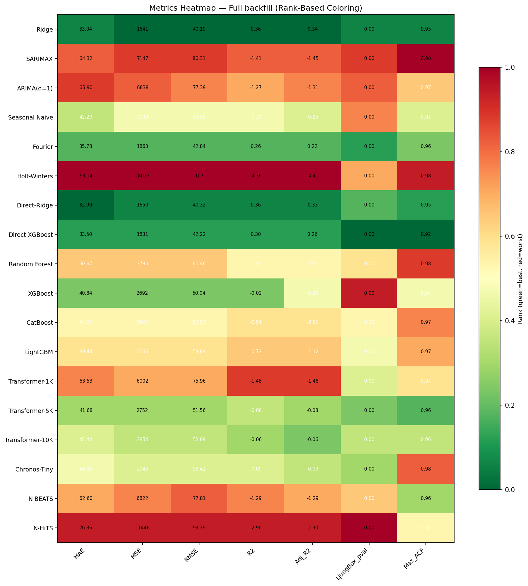

# Model Justification: Enhanced Direct-Ridge (RidgeFull)

> **Production model: RidgeFull (Enhanced Direct-Ridge) -- AVG MAE 24.88** A
> 24.6% improvement over the previous production model (Direct-Ridge, MAE
> 32.99), achieved through richer feature engineering, full historical data, and
> StandardScaler preprocessing.

## 1. Key Concepts and Terminology

This section explains the forecasting terminology used throughout the project
documentation.

### 1.1 The Forecasting Task

The model predicts **carbon intensity** (gCO2/kWh -- grams of CO2 emitted per
kilowatt-hour of electricity generated) for 5 UK regions, **7 days into the
future** at **30-minute intervals**. That means 336 individual predictions per
region per forecast cycle (`7 days x 48 half-hours = 336 steps`). Each of these
336 predictions is called a **horizon step** -- step 1 is 30 minutes from now,
step 336 is 7 days from now.

### 1.2 Direct vs Recursive Forecasting

There are two fundamentally different ways to produce multi-step forecasts:

- **Recursive forecasting**: Predict 30 minutes ahead, then feed that prediction
  back as input to predict 60 minutes ahead, then feed _that_ back to predict 90
  minutes, and so on 336 times. The problem is **error compounding** -- if step
  1 is slightly wrong, step 2 uses that wrong value as input, making it even
  more wrong, and the error snowballs over 336 steps. Tree-based models
  (XGBoost, CatBoost, LightGBM) and transformers were tested this way and
  suffered badly.

- **Direct forecasting** (what RidgeFull uses): Train a single model that takes
  the **horizon step number** as an input feature alongside all other features.
  To predict step 100, the model receives `h=100` as a feature and predicts
  directly from historical data -- it never uses its own past predictions as
  input. Each horizon step is independent, so errors at one step cannot affect
  others.

### 1.3 Feature Groups

The model's 65 input features fall into five groups:

**Temporal features (22)** -- encode _when_ the prediction target is. These use
**Fourier harmonics** (pairs of sine and cosine waves at different frequencies)
to represent cyclical time patterns. For example, `sin(2π × hour/24)` and
`cos(2π × hour/24)` together encode the hour of day as a smooth cycle -- hour 23
is close to hour 0, not far away as it would be if encoded as a raw number. Six
harmonics for hour-of-day capture increasingly fine-grained intra-day patterns
(the 1st harmonic captures the broad day/night cycle; the 6th captures short
patterns like the morning demand ramp). Also includes a weekend flag and a night
flag.

**Horizon features (4)** -- encode _how far ahead_ the prediction is. The raw
horizon `h` is supplemented with `h²`, `h³`, and `log(h)`. This lets the model
learn that forecast accuracy degrades non-linearly with distance -- it degrades
quickly at first (hours 1-24) then more gradually (days 3-7).

**Origin statistics (13)** -- summarise _what carbon intensity has been doing
recently_ at the time the forecast is made. "Origin" refers to the last known
data point before the forecast begins. Features include:

- **last_value**: The most recent carbon intensity reading.
- **mean_24h, std_24h, median_24h, min_24h, max_24h**: Summary statistics of the
  last 24 hours (48 readings). These tell the model about the current regime --
  is it a high-carbon day or a low-carbon day?
- **mean_7d, std_7d**: Same for the last 7 days, capturing weekly context.
- **lag_24h**: Carbon intensity exactly 24 hours ago (same time yesterday).
  Captures the daily cycle.
- **lag_7d**: Carbon intensity exactly 7 days ago (same time last week).
  Captures the weekly cycle.
- **trend**: Short-term direction (12-hour MA minus 24-hour MA). Positive means
  carbon intensity is rising.
- **same_hour_mean**: Historical average for this specific half-hour slot across
  all training data.

**A note on lag features.** A "lag" is simply a past value at a fixed offset.
`lag_N` means "the carbon intensity reading N steps ago" (each step is 30
minutes). Different models across the experiment phases used different lag sets:

| Model / Phase                 | Lag features                                    | Rationale                                                                                                                                                                                                                                                                                               |
| ----------------------------- | ----------------------------------------------- | ------------------------------------------------------------------------------------------------------------------------------------------------------------------------------------------------------------------------------------------------------------------------------------------------------- |
| Phase 1 recursive tree models | lag_1 through lag_48 (all 48 consecutive)       | Every reading from the last 24 hours. Gives the model fine-grained recent history, but 48 features adds noise.                                                                                                                                                                                          |
| Phase 2 enhanced tree models  | lag_1--12, 24, 48, 72, 96, 144, 336 (19 sparse) | Recent history (last 6 hours) at full resolution, then specific lookback points: 12h, 24h, 36h, 48h, 72h (3 days), and 336 (7 days = one full week). The weekly lag was the single most impactful addition.                                                                                             |
| Phase 4 seasonal tree models  | Phase 2 set + lag_672, lag_1344 (21 total)      | Added 2-week and 4-week lookbacks to capture longer seasonal patterns with the expanded training data.                                                                                                                                                                                                  |
| RidgeFull (production)        | lag_24h and lag_7d only (as origin stats)       | Direct models don't feed predictions back recursively, so fine-grained recent lags are less useful. Instead, lag_24h (same time yesterday) and lag_7d (same time last week) capture the key daily and weekly cycles. Other recent behaviour is summarised via rolling statistics (mean, std, min, max). |

The general principle: recursive models need many lags because each prediction
step feeds into the next, so the model must learn short-term dynamics from raw
past values. Direct models (like RidgeFull) predict each horizon independently,
so summary statistics (means, trends) are more useful than raw lags.

**Weather features (16)** -- encode _weather conditions at the target time_.
During training, these are actual historical weather from the Open-Meteo archive
aligned to each target timestamp. During inference, these are Open-Meteo weather
forecasts for each future horizon step. 10 raw features (temperature, humidity,
dewpoint, pressure, cloud cover, wind speed, wind direction, wind gusts, solar
radiation, precipitation) plus 6 engineered features:

- **wind_power**: Wind speed cubed, divided by 1000. Proportional to actual wind
  turbine power output (turbine output scales with the cube of wind speed, not
  linearly).
- **wind_ramp**: Change in wind speed from the previous reading. Captures sudden
  wind changes that rapidly shift generation mix.
- **pressure_change**: Change in atmospheric pressure. Indicates passing weather
  fronts that bring wind/rain changes.
- **solar_clearness**: Solar radiation divided by 1000. A normalised measure of
  how much sunlight is available for solar generation.
- **temp_deviation**: Temperature minus its 7-day rolling average. Captures
  unusual heat/cold that drives extra heating/cooling demand.
- **wind_dir_sin, wind_dir_cos**: Wind direction encoded as sine and cosine
  (same cyclic encoding idea as the temporal features -- 359° should be close to
  1°, not far from it).

**Interaction features (10)** -- **products of features from different groups**
that let a linear model capture non-linear relationships. For example,
`last_value × horizon` lets the model learn that a high current reading matters
more for short-term predictions than long-term ones. `wind_speed × hour_sin`
lets the model learn that wind has different effects at different times of day
(e.g., wind at night directly displaces gas generation, while wind during the
day also competes with solar).

### 1.4 Other Key Terms

- **MAE (Mean Absolute Error)**: The primary accuracy metric. The average of
  |predicted - actual| across all predictions. An MAE of 24.88 means on average,
  predictions are ~25 gCO2/kWh away from the true value. Lower is better.
- **CV (Coefficient of Variation)**: Standard deviation divided by mean.
  Measures how volatile a region's carbon intensity is relative to its average.
  Higher CV = harder to predict.
- **StandardScaler**: Normalises each feature to have mean 0 and standard
  deviation 1 before feeding it to the model. Without this, features with large
  absolute values (e.g., pressure ~1013 hPa) would dominate features with small
  values (e.g., wind_dir_sin in [-1, 1]) in Ridge regression.
- **RidgeCV**: Ridge regression with built-in cross-validation for the
  regularisation strength (alpha). Tries 8 candidate alpha values and picks the
  one that generalises best, removing the need for manual tuning.
- **Ensemble**: Combining predictions from multiple models (e.g., averaging
  Ridge + MLP + LightGBM). Tested but rejected because the gain was only 0.03
  MAE (0.1%) over RidgeFull alone.

## 2. Single Model Experiments

This project has undergone five phases of systematic experimentation to find the
best carbon intensity forecasting model, documented in
[experiment_report.md](./experiment_report.md). The progression:

### Phase 1: Baseline Benchmark (18 Models)

A comprehensive comparison of 18 forecasting approaches -- statistical,
tree-based, deep learning, and foundation models -- established Direct-Ridge as
the production model at MAE 32.99. This beat all 17 competitors on the full
backfill training set (~83 days, ~3,972 points). Key results:

| Model           | MAE   | Notes                            |
| --------------- | ----- | -------------------------------- |
| Direct-Ridge    | 32.99 | Winner -- simple, fast, accurate |
| Ridge           | 33.04 | Near-identical to Direct-Ridge   |
| Direct-XGBoost  | 33.50 | Close third                      |
| Fourier         | 35.78 | Pure periodic decomposition      |
| Seasonal Naive  | 42.20 | Repeat-last-week baseline        |
| Transformer-10K | 42.44 | Best neural approach             |
| SARIMAX         | 64.32 | Classical time series            |
| Holt-Winters    | 93.14 | Worst performer                  |

### Phases 2--4: Feature Engineering and Data Expansion

Subsequent phases focused on improving tree-based models through enhanced
features (Phase 2), residual targets (Phase 3), and full-year seasonal data
(Phase 4). CatBoost reached MAE 31.63 in Phase 4 -- the first model to beat
Direct-Ridge's 32.99.

### Phase 5: Weather Enrichment

Extended weather features (11 raw from Open-Meteo instead of 3) gave every tree
model a significant boost. Direct-XGBoost with Weather Variant A hit MAE 29.49
-- a 10.6% improvement over Direct-Ridge.

#### Weather Feature Ablation

Weather features are the single most impactful predictor category. The ablation
study from the [comparison_report.md](./benchmarks/comparison_report.md) (Full
Backfill results) demonstrates this clearly:

| Model           | With Weather | No Weather | Delta  |
| --------------- | ------------ | ---------- | ------ |
| Direct-Ridge    | 32.99        | 44.54      | -11.56 |
| Ridge           | 33.04        | 43.61      | -10.57 |
| Direct-XGBoost  | 33.50        | 40.80      | -7.30  |
| XGBoost         | 40.84        | 47.28      | -6.44  |
| Transformer-10K | 42.44        | 60.69      | -18.25 |
| CatBoost        | 47.05        | 45.34      | +1.70  |
| Random Forest   | 50.67        | 47.27      | +3.40  |
| LightGBM        | 49.44        | 45.14      | +4.30  |

Direct-Ridge benefits most from weather among non-transformer models (-11.56
MAE). This is because carbon intensity is fundamentally driven by weather: wind
speed determines wind generation, solar radiation determines solar generation,
and temperature drives heating/cooling demand. A linear model with properly
engineered weather features captures these relationships directly.

The finding that weather _hurts_ recursive tree models (CatBoost +1.70, RF
+3.40, LightGBM +4.30) is explained by the 336-step recursive forecasting: lag-1
weather values become stale by step 10, yet the model still conditions on them
for all 336 steps. Direct models avoid this because each horizon step gets its
own weather features independently.

## 3. Ensemble Experiments

After Phase 5, discussions with the client motivated further experimentation to
push accuracy beyond MAE 29.49. The goal was to explore combinations of models
-- including neural networks, gradient boosting, and ensembles -- to achieve
better predictions.

Evaluation in this phase switched from a simple train/test split to a
**train/validation/test** split: training on all data up to 14 days before the
latest reading, a 7-day validation window (used for ensemble weight selection),
and a held-out 7-day test window. This prevents information leakage from the
validation-based ensemble strategies (val-weighted, val-drop) into the test
evaluation.

### 3.1 Feature Engineering Overhaul

The single largest improvement came from expanding feature engineering from 14
features to 65 features:

| Feature Group | Old (14 features)           | New (65 features)                                                                                                     |
| ------------- | --------------------------- | --------------------------------------------------------------------------------------------------------------------- |
| Temporal      | 2 sin/cos pairs (hour, dow) | 22 features: 6 Fourier harmonics for hour-of-day, 2 for day-of-week, 2 for day-of-year, weekend flag, night flag      |
| Horizon       | 1 feature (h/336)           | 4 features: h, h-squared, h-cubed, log(h)                                                                             |
| Origin stats  | 3 (last, mean, std)         | 13 (+ median, min, max, 7-day stats, lag_24h, lag_7d, trend, same_hour_mean)                                          |
| Weather       | 3 raw                       | 16 (10 raw + 6 engineered: wind_power, wind_ramp, pressure_change, solar_clearness, temp_deviation, wind_dir sin/cos) |
| Interactions  | 0                           | 10 (last x horizon, weekend x hour, wind x hour, solar x hour, etc.)                                                  |
| Preprocessing | None                        | StandardScaler + RidgeCV (8 alpha candidates)                                                                         |

Key changes explained:

- **Richer Fourier harmonics**: 6 harmonics for hour-of-day capture complex
  intra-day patterns (e.g., morning ramp, midday solar peak, evening demand
  surge) that 1 harmonic misses entirely.
- **Polynomial horizon encoding**: h-cubed and log(h) let the model learn
  non-linear forecast degradation -- accuracy typically decays faster at short
  horizons and plateaus at long horizons.
- **Extended origin statistics**: Median, min, max, and 7-day rolling stats give
  the model a richer picture of recent carbon intensity behaviour. The lag_24h
  and lag_7d features capture same-time-yesterday and same-time-last-week values
  directly.
- **Engineered weather features**: wind_power (wind-cubed, proportional to
  actual turbine output), solar_clearness (radiation / 1000), pressure_change
  (frontal systems), and wind_ramp (wind speed change) encode domain-relevant
  physical relationships.
- **Interaction features**: Cross-terms like last_value x horizon and wind_speed
  x hour_sin let a linear model capture multiplicative effects that would
  otherwise require non-linear models.
- **StandardScaler**: Critical for Ridge regression -- without normalisation,
  features with large absolute values (e.g., pressure ~1013 hPa) dominate
  features with small values (e.g., wind_dir_sin in [-1, 1]).
- **RidgeCV**: Automatically selects the best regularisation alpha from 8
  candidates [0.01, 0.1, 0.5, 1.0, 5.0, 10.0, 50.0, 100.0], removing the need
  for manual hyperparameter tuning.

### 3.2 Full Historical Data

The new model reads directly from `carbon_intensity.db`, using the full
historical record (~17,488 readings per region, approximately 1 year of data)
instead of the previous 60-day cap. This provides:

- More seasonal coverage (summer + winter patterns)
- More weather regime diversity (calm vs. stormy periods)
- Better estimation of long-range origin statistics (7-day rolling windows
  require 7+ days of history to be meaningful)

### 3.3 How Weather Is Used

The v1 Direct-Ridge used **lag-1 weather** -- the single most recent weather
observation was repeated for all 336 horizon steps. This meant weather was stale
by step 10 and irrelevant by Day 3.

RidgeFull uses **per-target weather**:

- **During training**: archive (ground-truth) weather from Open-Meteo is aligned
  to each target timestamp. For a training sample with origin at time _t_
  predicting horizon _h_, the weather features come from time _t + h_, not time
  _t_. This teaches the model the true relationship between weather conditions
  and carbon intensity at the time being predicted.
- **During inference**: the Open-Meteo forecast API provides hourly weather
  predictions for the next 7+ days. Each of the 336 future horizon steps
  receives the weather forecast for its specific timestamp. The 10 raw weather
  values are then passed through the same engineering pipeline (wind_power,
  wind_ramp, pressure_change, solar_clearness, temp_deviation, wind_dir sin/cos)
  to produce the full 16 weather features.

This per-target approach is why RidgeFull improved so dramatically over the v1
model -- the weather features are informative at every horizon, not just the
first few steps.

### 3.4 Weather Caching

A pickle-based caching layer for Open-Meteo weather data (`.weather_cache/`)
enables fast repeated access during experimentation and benchmarking without
hitting API rate limits.

### 3.5 Individual Model Results

The following models were trained on the 65-feature set and evaluated
independently:

| Model                         | AVG MAE     | Time / Region | Notes                                            |
| ----------------------------- | ----------- | ------------- | ------------------------------------------------ |
| **RidgeFull**                 | **24.88**   | < 1 sec       | 65 features, full year, StandardScaler           |
| RidgeBase (no interactions)   | 25.22       | < 1 sec       | 55 features, no interaction terms                |
| PyTorch MLP (2048,1024,512)   | 27.30-28.20 | 3-5 min       | Dropout+BatchNorm+GELU, inconsistent across runs |
| LightGBM                      | 27.70-27.86 | 5-10 sec      | 150K subsample, num_leaves=255                   |
| Conditioned MLP (all regions) | 30.45       | 5+ min        | One-hot region encoding, did not help            |

### 3.6 Ensemble Strategy Results

Various ensemble strategies were tested, combining subsets of the individual
models above:

| Ensemble Strategy | Models Combined                  | AVG MAE     |
| ----------------- | -------------------------------- | ----------- |
| Median ensemble   | RidgeF, RidgeBase, MLP, LightGBM | 24.85       |
| Val-weighted      | RidgeF, RidgeBase, MLP, LightGBM | 24.78-24.83 |
| Trimmed mean      | RidgeF, RidgeBase, MLP           | 24.76-25.08 |

The best ensemble (median, MAE 24.85) improves over RidgeFull (24.88) by only
**0.03 MAE** (0.1%). This marginal improvement does not justify the added
complexity -- see Section 4 for the full argument.

### 3.7 Actual vs Predicted

## 4. Why RidgeFull Over an Ensemble?

The best ensemble (median of RidgeF, RidgeBase, MLP, LightGBM) achieves MAE
24.85 vs RidgeFull's 24.88 -- a **0.03 improvement** (0.1%):

- **Marginal accuracy gain**: 0.03 MAE is within measurement noise and not worth
  the added complexity.
- **4x model maintenance**: Four models to train, debug, and monitor instead of
  one. Each model has its own failure modes and hyperparameters.
- **MLP training latency**: The MLP component takes 3-5 minutes to train per
  region. In a 5-region production system, this adds 15-25 minutes to each
  prediction cycle -- unacceptable for an API that needs to respond in seconds.
  For predicting 14 regions, thats even more.
- **Inconsistent improvement**: The ensemble sometimes hurts on specific regions
  where MLP or LightGBM predictions pull the aggregate away from Ridge's correct
  answer.

## 5. Future Work

Potential approaches to improve accuracy further:

- **Weather forecast--training alignment**: RidgeFull already uses Open-Meteo
  weather forecasts at inference, but trains on archive (ground-truth) weather.
  Bridging this distribution gap -- via noise injection, horizon-dependent
  weather weighting, or training on historical forecasts -- could improve
  mid-range horizon accuracy.
- **Cross-region modelling**: Joint forecasting across regions could capture
  spatial correlations (e.g., wind fronts moving from North to South).
- **Online learning**: Continuous model updates as new data arrives, adapting to
  regime changes faster than periodic retraining.
- **Additional exogenous features**: Gas prices, interconnector flows, or
  day-ahead market data could provide leading indicators of generation mix
  changes.
