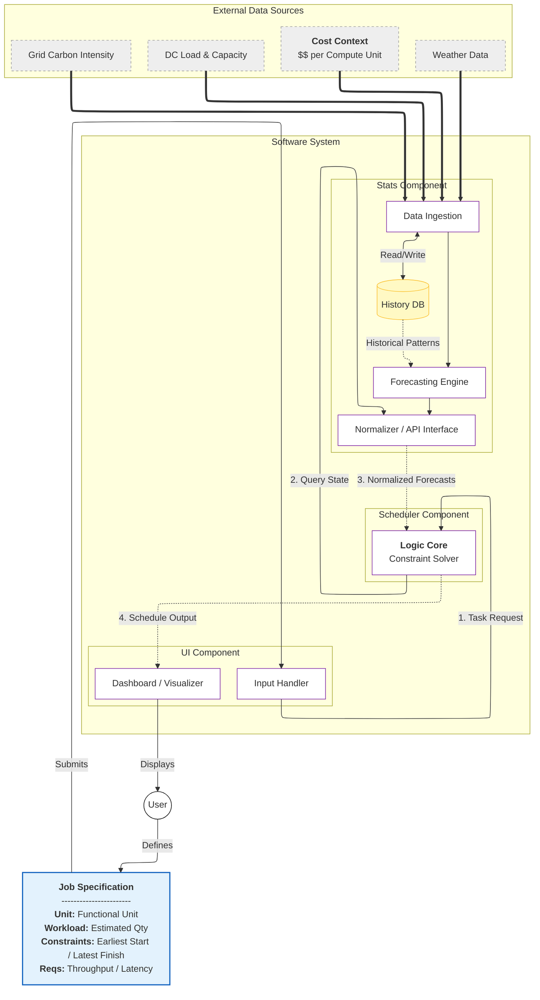
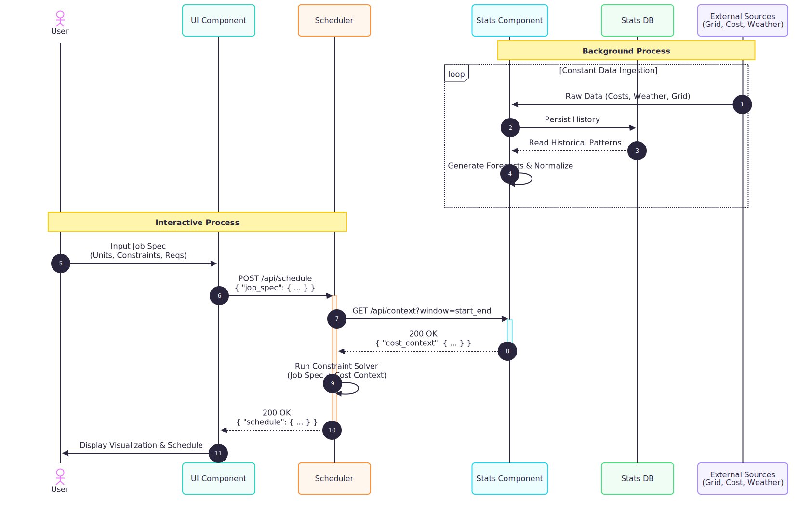

# System Design Specification

This document briefs on the architectural design of this software system.

## Overview

The System will be comprised of three independent components:

- Scheduler: the core logical computational program
- Stats: ingests and forecasts external data under a uniform interface for the Scheduler
- UI: a web-app to take user input and display Scheduler output

The components are independent software processes separated on an area-of-concern basis.
The components will interact and communicate using HTTP (RESTful) APIs.
Having the API on the network layer maximizes modularity, allowing each component to be developed
both in parallel and in whatever language and dev stack that is the most appropriate for the job.

## Components

### Scheduler

This is the core logical program that determines the best "deployment schedule" for
a given AI workload to "minimize environmental impact".

The environmental and stateful data required for the scheduling is obtained from
the Stats component.
Ultimately, the user interacts with the scheduler via the UI, where the outputs
are also visualized/displayed.

### Stats

The scheduling work requires multiple types of data,
each of which may have multiple sources:

- environmental (per location over time): grid carbon intensity, weather, etc.
- data center state (per center): current load, total capacity, etc.
- temporary constraints (misc factors)

The Stats component should integrate with these sources and relay the data,
potentially with forecasts, to the Scheduler under an uniform interface.

Of course, this component also handles data sanitation, normalization, persistence, etc.

### UI

Standard server-side rendered web-app.
This component provides the human-computer interface.

The main interfaces will include:

- visualizations of data center states together with the environmental costs at each
- task input / control
- presentation of the scheduler output for a task

## Interconnection



```mermad
sequenceDiagram
    autonumber
    actor U as User
    participant UI as UI Component
    participant Sched as Scheduler
    participant Stats as Stats Component
    participant DB as Stats DB
    participant Ext as External Sources<br>(Grid, Cost, Weather)

    %% -- Phase 1: Background Ingestion Loop --
    note over Stats, Ext: Background Process
    loop Constant Data Ingestion
        Ext->>Stats: Raw Data (Costs, Weather, Grid)
        Stats->>DB: Persist History
        DB-->>Stats: Read Historical Patterns
        Stats->>Stats: Generate Forecasts & Normalize
    end

    %% -- Phase 2: User Action --
    note over U, Sched: Interactive Process
    U->>UI: Input Job Spec<br>(Units, Constraints, Reqs)

    %% UI to Scheduler
    UI->>Sched: POST /api/schedule<br>{ "job_spec": { ... } }
    activate Sched

    %% Scheduler needs context
    Sched->>Stats: GET /api/context?window=start_end
    activate Stats
    Stats-->>Sched: 200 OK <br>{ "cost_context": { ... } }
    deactivate Stats

    %% Logic Calculation
    Sched->>Sched: Run Constraint Solver<br>(Job Spec + Cost Context)

    %% Return Result
    Sched-->>UI: 200 OK<br>{ "schedule": { ... } }
    deactivate Sched

    UI->>U: Display Visualization & Schedule
```

## Rendered Diagrams




